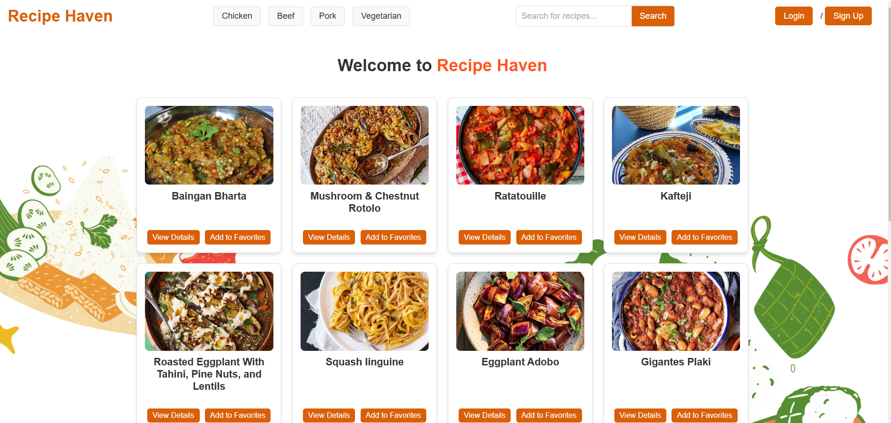
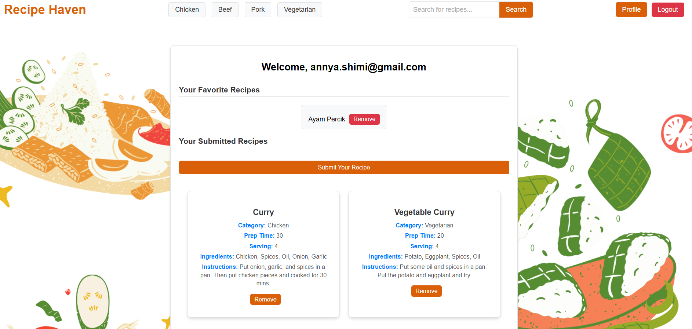
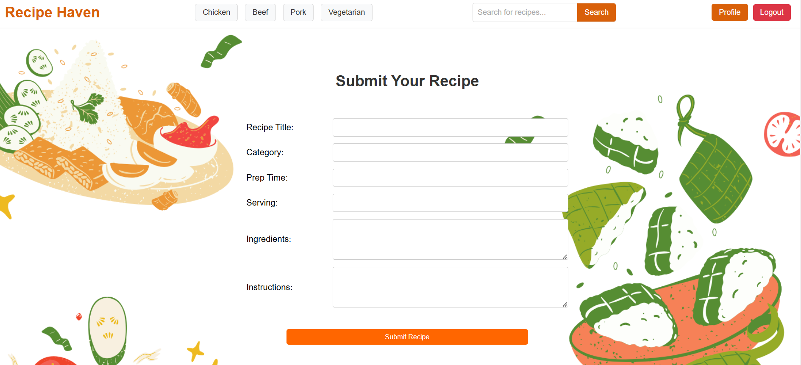
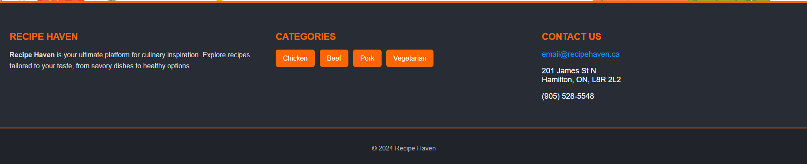

Application: Recipe Haven

Introduction

Recipe Haven is a full-stack web application for browsing and managing recipes. Users can explore recipes from various categories, search for specific meals, submit their own recipes (stored in their profile), and save their favorite recipes for future reference. This application is built using the MERN stack (MongoDB, Express.js, React.js, Node.js) and interacts with TheMealDB API for recipe data.

Features

- User authentication: Login, register, and manage profile.
- View recipes from various categories like Chicken, Beef, Pork, and Vegetarian.
- Search recipes by by keywords.
- View detailed recipe information and ingredients.
- Submit your own recipes (stored in your profile)
- Save favorite recipes to your profile
- Easy navigation between different categories and search results.
- Fully responsive design

Technologies Used

Frontend:

- React.js
- Axios
- React Router
- CSS for styling

Backend:

- Node.js
- Express.js
- MongoDB (via Mongoose)
- bcrypt for password hashing
- dotenv for environment variables

Setup Instructions

Prerequisites:

- Install Node.js
- Install MongoDB
- Clone the repository
  git clone https://github.com/anshimi/recipe-app.git

Environment Variables

Create a .env file in the root directories for both frontend and backend. Include the following variables:

- Backend .env:

MONGO_URI=your_mongodb_connection_string
(For security reason I am not allowed to provide the link)

- Frontend .env:

VITE_BE_URL=http://localhost:4000

Running the Application

Step 1: Install Dependencies

Navigate to the backend and frontend directories and run the following command to install all required dependencies:
npm install

Step 2: Start the Backend

Go to the server directory and run the backend using:
node index.js

Step 3: Start the Frontend

npm run dev

Folder Structure

Backend

server/
│
├── models/ # Mongoose schemas for MongoDB
│ ├── recipe.js # Schema for recipes
│ └── user.js # Schema for users
│
├── node_modules/ # Backend dependencies  
├── .env # Environment variables for the backend  
├── .gitignore # Specifies files and folders to ignore in version control  
├── index.js # Entry point for the backend server  
├── package-lock.json # Lockfile for backend dependencies  
├── package.json # Backend package configuration  
└── README.md # Documentation file

Frontend

client/ -- Showing Components and Main files

├── src/ # Source code for the React application  
│ ├── components/ # Reusable components
│ │ ├── AuthContext.jsx # Context for user authentication  
│ │ ├── Footer.jsx # Footer component  
│ │ ├── Footer.css # Footer-specific styles  
│ │ ├── Navbar.jsx # Navigation bar component  
│ │ ├── RecipeCard.jsx # Recipe card component  
│ │ └── SearchBar.jsx # Search bar component  
│ ├── pages/ # Main pages of the application  
│ │ ├── Home.jsx # Homepage  
│ │ ├── Profile.jsx # User profile page  
│ │ ├── RecipeDetails.jsx # Recipe details page  
│ │ ├── ResultsPage.jsx # Search results page  
│ │ └── SubmitRecipe.jsx # Recipe submission page  
│ ├── user/ # User-specific pages  
│ │ ├── Login.jsx # Login page  
│ │ └── Register.jsx # Registration page  
│ ├── App.css # Global CSS styles  
│ ├── App.jsx # Main application component  
│ ├── index.css # Additional global styles  
│ └── main.jsx # Entry point for the React application  
│
├── .env # Environment variables for the frontend  
├── .gitignore # Specifies files and folders to

Usage Instructions

Register and Login

- Register with your email and password.
- Login to access features like adding favorites and submitting recipes.

Browse Recipes

- Use the search bar or category filters to discover recipes.

View Recipe Details

- Click on a recipe card to see detailed instructions and ingredients.

Save Favorites

- Add recipes to your favorites for easy access later.

Submit Recipes

- Share your creations by submitting a recipe with a title, category, and other details.

API Endpoints

User Management

- POST /api/register: Register a new user.
- POST /api/login: Login a user.
- GET /api/profile/:userId: Fetch profile details

Favorites

- GET /api/favorites/:userId: Get a user’s favorite recipes.
- POST /api/add-favorite: Add a recipe to favorites.
- DELETE /api/favorites/:userId/:recipeId: Remove a recipe from favorites.

Submitted Recipes

- POST /api/submittedrecipes: Submit a new recipe.
- GET /api/submittedrecipes: Get user-submitted recipes.
- DELETE /api/submittedrecipes/:recipeId: Delete a submitted recipe.

Description of the application

- Home Page:

The homepage displays a grid of recipes with options to filter by category. Users can view details or add recipes to their favorites.

- Recipe Details Page:

This page shows detailed information about a recipe, including a list of ingredients and step-by-step instructions.

- Login Page:

The login page enables users to securely log in to access features like submitting recipes, viewing favorites, and managing their profile.

- Profile Page:

The profile page displays user information, favorite recipes, and recipes submitted by the user.

- Submit Recipe Page:

This page lets users submit their own recipes by entering a title, category, ingredients, and instructions.

- Footer Page:

The footer section is displayed at the bottom of the application. It includes navigation links and provides quick access to important sections.

